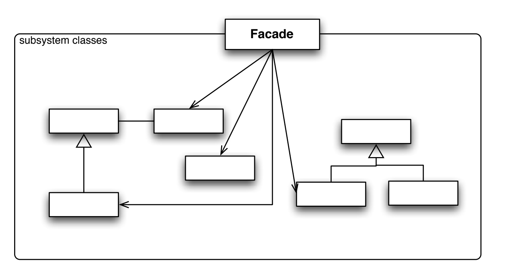
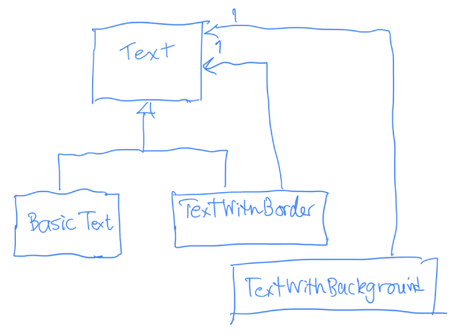

# Design Pattern

---
## Creation
* singleton

    สร้าง object เดียวเท่านั้น class อื่นไม่สามารถ instantiate single class ได้เริ่ม instantiate เมื่อต้องการเท่านั้น

* factory method

    เพิ่ม methos ใน class เพื่อสร้าง object ที่มรความคล้ายกัน A1, A2, A3 เป็นส่วนหนึ่งของ template method pattern

    

* abstract factory
    เพิ่ม class ใหม่สำหรับสร้าง object ที่มี category หลายแบบ A1, A2, B1, B2, C1, C2

    

## Structural
* facade
    
    like controller ซ่อนความซับซ้อนและติดต่อ class อื่นอีกที

    

* adaptor

    มี class เดิมที่ทำงานได้อยู่แล้วแต่ interface ไม่ตรงตามที่ต้องการต้อง adaptor เพื่อให้เรียกใช้ class เดิมผ่าน interface ใหม่ได้

    

* proxy

    มี class ทำงานอยู่แล้ว**มี interface ตรงตามต้องการอยู่แล้ว** แต่ต้องการเพิ่ม feature บางอย่างจากของเดิม ex. ความเร็ว, ความปลอดภัย

    

* composition
    
    object มี interface เดียวกัน ประเภทนึงมีลูก(internal node) และอีกประเภทไม่มีลูก(leafnode) **ต้องวนลูปลูกเสมอ และเรียก method ของลูกที่ตรงกับของแม่**

    

* decorator

    คล้าย composite แต่จะเรียกตัวเองแค่ 1 ครั้ง

    

## Behavioral
* template method

    แบ่งการทำงานออกเป็น 2 ส่วน
    1. template ฟังก์ชันที่ทำงานเหมือนกันทุก subclass(template method) 
    2. ฟังก์ชันที่เปลี่ยนไปตาม subclass(abstract method)
    
    มี defualt(**conrete method**) และไม่มี default(**adstract method**)

    

* iterator

    data structure มี interface ไม่เหมือนกันต้องการเข้าถึงโดยใช้ interface เดียวกันโดยไม่ต้องรู้โครงสร้างของ data structure

* visitor

    หากต้องการเพิ่ม subclass และ feature ทำให้ต้องแก่ทุก class แก้โดยเปลี่ยน method -> class เปลี่ยน class -> method 
    ``เพิ่ม animal จะต้องแก้หมดเลย``

    

* state

    implement โปรแกรมแบบ state machine เปลี่ยน representation ของ object ตามเงื่อนไข เพิ่ม state ง่ายเพิ่ม transition ยาก

    